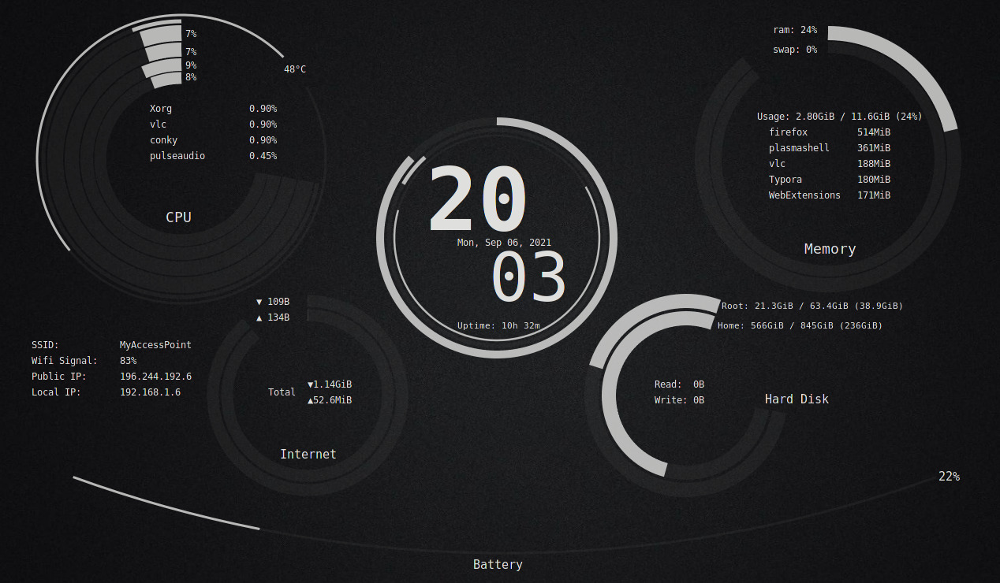
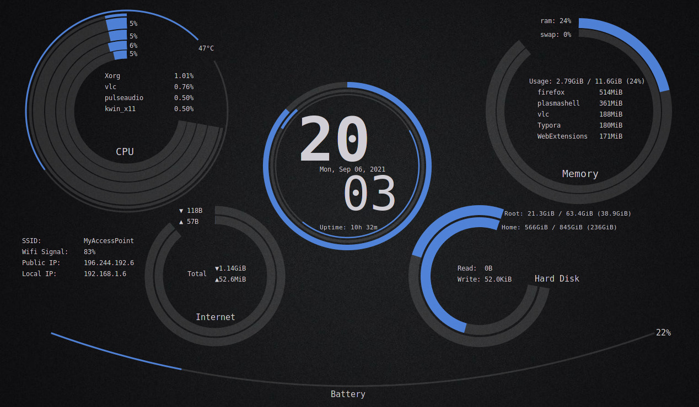
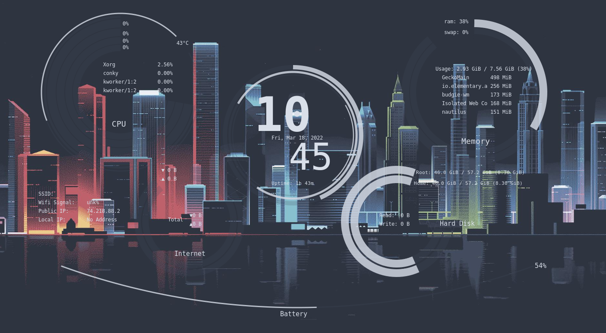
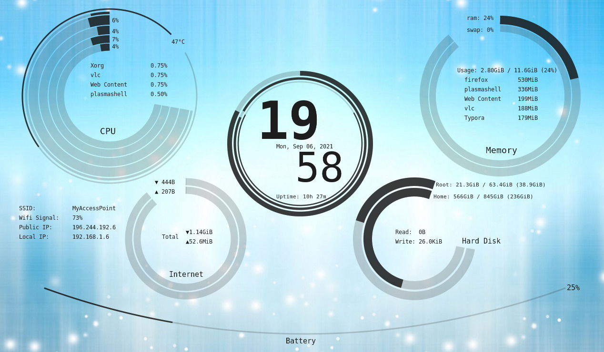
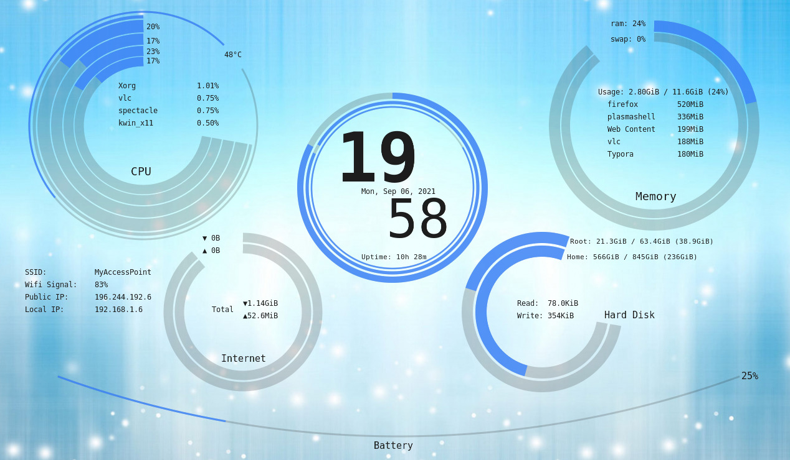
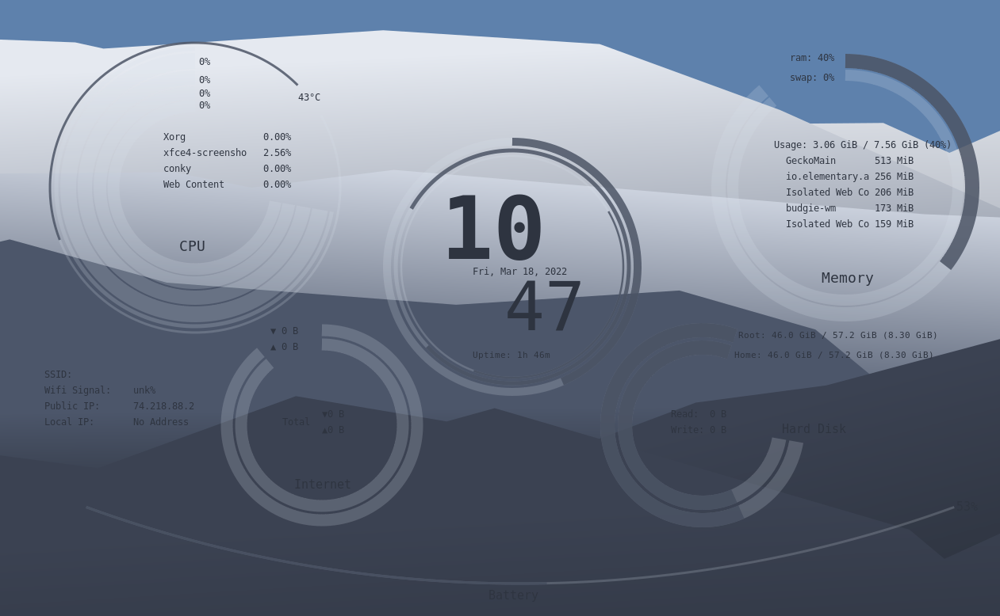

# Auzia-conky

Auzia is a conky theme that displays system resources usage in rings.

## Screenshots

### For dark themes

##### monochrome dark



##### blue dark




##### nordic monochrome dark



***

### For light themes

##### monochrome light




##### blue light




##### nordic monochrome light




More colors schemes are available. Choose a color from the `settings.lua` file and restart conky to take effect.

***

## Download and Launch Auzia

```sh
git clone https://www.github.com/SZinedine/auzia-conky
cd auzia-conky
conky -c conkyrc
```

Edit `settings.lua` to choose your network interface, Internet speed and other settings.

***

## Dependencies

- Conky 1.10+
- cairo
- imlib2

